<div align="center">
<!-- Hero Banner -->


<!-- Profile Badges -->
<p align="center">
  
  
  
</p>

---
<!-- Animated Typing -->
<a href="https://git.io/typing-svg"></a>


## 📈 Contribution Graph

<div align="center">


</div>

---
---

## 📊 GitHub Analytics

<div align="center">
  
<!-- GitHub Stats Cards -->


<!-- GitHub Streak Stats -->


<!-- Activity Graph -->


<!-- Trophy -->


</div>

---

## 🎯 About Me

```python
class AnkitKumar:
    def __init__(self):
        self.username = "eddiebrock911"
        self.name = "Ankit Kumar"
        self.role = "Full Stack Developer & ML Engineer"
        self.location = "India 🇮🇳"
        self.education = "Computer Science"
        self.current_project = "BabyAI - Personal AI Assistant"
        self.languages = ["Python", "JavaScript", "SQL", "HTML", "CSS"]
        
    def get_current_focus(self):
        return [
            "Machine Learning & Deep Learning",
            "Natural Language Processing (NLP)",
            "Computer Vision with OpenCV",
            "Full Stack Web Development",
            "AI-Powered Applications"
        ]
    
    def say_hi(self):
        print("Thanks for dropping by! Let's build something amazing together!")

ankit = AnkitKumar()
ankit.say_hi()
```

<div align="center">

## 🏆 Featured Projects

<!-- Project Cards with Enhanced Styling -->
<table>
<tr>
<td width="50%">

### 🏏 IPL Win Predictor
**ML-Powered Cricket Analytics**


Predict IPL match outcomes using advanced machine learning algorithms with real-time data analysis.

**[🚀 Live Demo](https://iplwinprokit.onrender.com)** | **[📂 Repository](https://github.com/eddiebrock911/IPL-Win-Probability-Predictor-Project)**

</td>
<td width="50%">

### 🏅 Olympics Analysis Dashboard
**Interactive Data Visualization**


Comprehensive Olympic data analysis with interactive visualizations and historical insights.

**[🚀 Live Demo](https://olympikit.onrender.com)** | **[📂 Repository](https://github.com/eddiebrock911/Olympics-analysis-app)**

</td>
</tr>
<tr>
<td width="50%">

### 📧 SMS/Email Classifier
**Intelligent Spam Detection**


Advanced spam detection system using NLP and machine learning techniques.

**[🚀 Live Demo](https://antispamkit.onrender.com)** | **[📂 Repository](https://github.com/eddiebrock911/sms-email-classification-)**

</td>
<td width="50%">

### 🤖 BabyAI
**Personal AI Assistant** `🚧 In Development`


Next-generation AI assistant with advanced NLP capabilities and personalized learning.

**[📂 Repository](#)** | **[📖 Docs](#)**

</td>
</tr>
</table>

</div>

---

## 💻 Tech Stack & Tools

<div align="center">

### 🌐 Languages


### 🤖 AI/ML & Data Science


### ⚛️ Frontend Development


### 🔧 Backend & Databases


### ☁️ Cloud & DevOps


### 🎮 Other Tools


</div>

---

## 🎓 Learning Journey

```mermaid
graph LR
    A[🎯 Current Focus] --> B[Machine Learning]
    A --> C[Deep Learning]
    A --> D[NLP]
    B --> E[Supervised Learning]
    B --> F[Unsupervised Learning]
    C --> G[Neural Networks]
    C --> H[CNNs & RNNs]
    D --> I[Transformers]
    D --> J[BERT & GPT]
    
    style A fill:#00D9FF,stroke:#fff,stroke-width:2px,color:#000
    style B fill:#FF6B6B,stroke:#fff,stroke-width:2px,color:#fff
    style C fill:#4ECDC4,stroke:#fff,stroke-width:2px,color:#fff
    style D fill:#FFE66D,stroke:#fff,stroke-width:2px,color:#000
```

<div align="center">



</div>

---

## 🌟 Highlights

<div align="center">

| 🎯 Achievement | 📊 Stats | 🏆 Recognition |
|:-------------:|:--------:|:-------------:|
| **Projects Completed** | 15+ | ⭐️⭐️⭐️⭐️⭐️ |
| **ML Models Trained** | 30+ | 🤖🤖🤖🤖🤖 |
| **Lines of Code** | 100K+ | 💻💻💻💻💻 |
| **Coffee Consumed** | ∞ | ☕️☕️☕️☕️☕️ |

</div>

---

## 🤝 Let's Connect

<div align="center">

[](https://ankitai.onrender.com)
[](https://linkedin.com/in/eddie-brock-364ba537b)
[](https://kaggle.com/ankitkumar8252)
[](https://instagram.com/__ankit._.op_)
[](mailto:ankitkumar823089@gmail.com)

</div>

---

## 💭 Quote of the Day

<div align="center">


</div>

---
<!-- Animated Snake -->
<picture>
  <source media="(prefers-color-scheme: dark)" srcset="https://raw.githubusercontent.com/eddiebrock911/eddiebrock911/output/github-contribution-grid-snake-dark.svg">
  <source media="(prefers-color-scheme: light)" srcset="https://raw.githubusercontent.com/eddiebrock911/eddiebrock911/output/github-contribution-grid-snake.svg">
  
</picture>

</div>

## 📝 Latest Blog Posts

<!-- BLOG-POST-LIST:START -->
- 🤖 Building an AI Assistant from Scratch
- 🏏 Machine Learning in Cricket Analytics
- 📊 Data Visualization Best Practices
- 🧠 Understanding Neural Networks
- 🚀 Deploying ML Models to Production
<!-- BLOG-POST-LIST:END -->

---

<div align="center">

### 💖 Support My Work

If you like my projects, consider buying me a coffee!

[](https://buymeacoffee.com/eddie.brock)

---

### ⚡ Fun Fact

```javascript
while(alive) {
    eat();
    study()
    code();
    sleep();
    repeat();
}
```

---

**"Code is poetry written in logic"** — Ankit Kumar


<sub>Made with ❤️ by Ankit Kumar | Last Updated: 18 jan 2026</sub>

</div>
