<div align="center">

<!-- ╔══════════════════════════════════════════╗ -->
<!--              HERO SECTION                  -->
<!-- ╚══════════════════════════════════════════╝ -->


<!-- Animated Typing -->
<a href="https://git.io/typing-svg"></a>

---
<br/><br/>

<!-- Status Badges -->


<br/><br/>

<!-- Profile Badges -->


<br/><br/>

<!-- Social Links -->
<a href="https://ankitai.onrender.com">
  
</a>
<a href="https://linkedin.com/in/eddie-brock-364ba537b">
  
</a>
<a href="https://kaggle.com/ankitkumar8252">
  
</a>
<a href="https://instagram.com/__ankit._.op_">
  
</a>
<a href="mailto:ankitkumar823089@gmail.com">
  
</a>
<a href="https://buymeacoffee.com/eddie.brock">
  
</a>

</div>

<br/>

<!-- ╔══════════════════════════════════════════╗ -->
<!--           GITHUB ANALYTICS                 -->
<!-- ╚══════════════════════════════════════════╝ -->

##  &nbsp;GitHub Analytics

<div align="center">


<br/>


<br/>


<br/>


<br/>


<br/>


</div>


<!-- ╔══════════════════════════════════════════╗ -->
<!--              ABOUT ME                      -->
<!-- ╚══════════════════════════════════════════╝ -->


##  &nbsp;`whoami`

```python
#!/usr/bin/env python3
# ━━━━━━━━━━━━━━━━━━━━━━━━━━━━━━━━━━━━━━━━━━━━━━━━━━━━
#  Developer Profile — Ankit Kumar  |  eddiebrock911
# ━━━━━━━━━━━━━━━━━━━━━━━━━━━━━━━━━━━━━━━━━━━━━━━━━━━━

class AnkitKumar:
    def __init__(self):
        self.name            = "Ankit Kumar"
        self.alias           = "eddiebrock911"
        self.role            = ["AI Engineer", "ML Specialist", "Full Stack Developer"]
        self.location        = "Patna, Bihar, India 🇮🇳"
        self.education       = "Computer Science"
        self.flagship        = "BabyAI — Next-Gen Personal AI Assistant 🤖"
        self.email           = "ankitkumar823089@gmail.com"
        self.portfolio       = "https://ankitai.onrender.com"

        self.skills = {
            "AI / ML"       : ["Deep Learning", "NLP", "Computer Vision", "Transformers", "BERT/GPT"],
            "Languages"     : ["Python 🐍", "JavaScript ⚡", "C++", "SQL", "HTML/CSS"],
            "Frontend"      : ["React", "Next.js", "Tailwind CSS", "Redux"],
            "Backend"       : ["Flask", "Django", "Node.js", "REST APIs"],
            "Databases"     : ["MySQL", "MongoDB", "SQLite"],
            "Cloud/DevOps"  : ["AWS", "Docker", "GitHub Actions", "Render", "Vercel"],
            "Tools"         : ["VS Code", "Jupyter", "Postman", "Linux", "Git"],
        }

        self.dream = "🌌 Build AI-driven living ecosystems on Mars"
        self.fact  = "I debug at 3AM and somehow it always works 😅"

    def current_status(self):
        return {
            "building"   : "BabyAI — Emotion Sensing + Wake Word + Camera Vision",
            "learning"   : "Transformers, LLMs, Reinforcement Learning",
            "open_to"    : ["Internships", "Freelance", "AI/ML Collaboration", "Research"],
        }

me = AnkitKumar()
print(f"👋 Hey! I'm {me.name} — {me.dream}")
# Output: 👋 Hey! I'm Ankit Kumar — 🌌 Build AI-driven living ecosystems on Mars
```

<div align="center">

<br/>

|  🗂️ Projects  |  🤖 ML Models  |  💻 Lines of Code  |  ☕ Coffees  |  🌟 GitHub Stars  |
|:---:|:---:|:---:|:---:|:---:|
| **15+** | **30+** | **100K+** | **∞** | **Growing** |

</div>


<!-- ╔══════════════════════════════════════════╗ -->
<!--           FEATURED PROJECTS                -->
<!-- ╚══════════════════════════════════════════╝ -->

## 🏆 Featured Projects

<div align="center">

<table>
<tr>
<td width="50%" valign="top">

<h3>🤖 BabyAI — Flagship Project</h3>


> *Next-Generation Personal AI Assistant*


```
🎭 Emotion Sensing    → Real-time emotion detection
🔊 Wake-Word Engine   → Always-on voice activation
📷 Camera Vision      → Advanced CV & object recognition
🧠 Personalized AI    → Learns your preferences over time
```

**[📂 Repo](#)** &nbsp;·&nbsp; **[📖 Docs](#)**

</td>
<td width="50%" valign="top">

<h3>🏏 IPL Win Predictor</h3>


> *ML-Powered Cricket Analytics*


Real-time IPL match win probability predictor using Logistic Regression trained on 10+ years of historical match data. Interactive UI with live score inputs.

**[🚀 Live Demo](https://iplwinprokit.onrender.com)** &nbsp;·&nbsp; **[📂 Repo](https://github.com/eddiebrock911/IPL-Win-Probability-Predictor-Project)**

</td>
</tr>
<tr>
<td width="50%" valign="top">

<h3>📧 SMS / Email Spam Classifier</h3>


> *Intelligent NLP-Based Detection*


TF-IDF vectorization + Naive Bayes classifier with 97%+ accuracy on real spam datasets. Handles SMS, email & multi-language inputs.

**[🚀 Live Demo](https://antispamkit.onrender.com)** &nbsp;·&nbsp; **[📂 Repo](https://github.com/eddiebrock911/sms-email-classification-)**

</td>
<td width="50%" valign="top">

<h3>🏅 Olympics Analysis Dashboard</h3>


> *Interactive Data Visualization*


Comprehensive Olympic data explorer with medal tallies, athlete comparisons, country rankings, and decade-wise trend analysis.

**[🚀 Live Demo](https://olympikit.onrender.com)** &nbsp;·&nbsp; **[📂 Repo](https://github.com/eddiebrock911/Olympics-analysis-app)**

</td>
</tr>
<tr>
<td width="50%" valign="top">

<h3>🎮 Space Shooters Game</h3>


> *Vanilla JS Browser Arcade*


Fast-paced space shooter with enemy AI waves, particle explosions, score multipliers & difficulty scaling. Zero dependencies — pure Vanilla JS engine.

**[🎮 Play Now](https://tickit-rht5.onrender.com/)** &nbsp;·&nbsp; **[📂 Repo](https://github.com/eddiebrock911/Space-Shooters-Game)**

</td>
<td width="50%" valign="top">

<h3>🎬 Movie Recommender System</h3>


> *Content-Based + Collaborative Filtering*


Personalized movie recommendations using cosine similarity on TF-IDF genre vectors combined with collaborative filtering on 5000+ movie dataset.

**[🚀 Live Demo](https://movieskit.onrender.com/)** &nbsp;·&nbsp; **[📂 Repo](https://github.com/eddiebrock911/movies-recommendation-system-)**

</td>
</tr>
</table>

</div>


<!-- ╔══════════════════════════════════════════╗ -->
<!--              TECH STACK                    -->
<!-- ╚══════════════════════════════════════════╝ -->

##  &nbsp;Tech Stack

<div align="center">

**🌐 Languages**


**🤖 AI / ML & Data Science**


**⚛️ Frontend**


**🔧 Backend & Databases**


**☁️ Cloud & DevOps**


**🛠️ Dev Tools**


</div>


<!-- ╔══════════════════════════════════════════╗ -->
<!--           LEARNING ROADMAP                 -->
<!-- ╚══════════════════════════════════════════╝ -->

## 🗺️ Learning Roadmap

```mermaid
graph TD
    ROOT(["⚡ Ankit Kumar\nAI Engineer"])

    ROOT --> ML(["🤖 Machine Learning"])
    ROOT --> DL(["🧠 Deep Learning"])
    ROOT --> NLP(["💬 NLP"])
    ROOT --> CV(["👁️ Computer Vision"])
    ROOT --> WEB(["🌐 Full Stack"])

    ML --> ML1(["📊 Supervised\nLearning"])
    ML --> ML2(["🔍 Unsupervised\nLearning"])
    ML --> ML3(["🎰 Reinforcement\nLearning"])

    DL --> DL1(["🕸️ Neural Networks"])
    DL --> DL2(["🖼️ CNNs"])
    DL --> DL3(["🔄 RNNs & LSTMs"])

    NLP --> NLP1(["🔤 Transformers"])
    NLP --> NLP2(["🧬 BERT & GPT"])
    NLP --> NLP3(["📝 Text Classification"])

    CV --> CV1(["📷 OpenCV"])
    CV --> CV2(["🎯 Object Detection"])
    CV --> CV3(["😊 Emotion AI"])

    WEB --> WEB1(["⚛️ React/Next.js"])
    WEB --> WEB2(["🐍 Flask/Django"])
    WEB --> WEB3(["☁️ AWS/Docker"])

    style ROOT fill:#00D4FF,stroke:#00D4FF,color:#000,font-weight:bold
    style ML   fill:#FF6B6B,stroke:#FF6B6B,color:#fff
    style DL   fill:#4ECDC4,stroke:#4ECDC4,color:#fff
    style NLP  fill:#FFE66D,stroke:#FFE66D,color:#000
    style CV   fill:#A78BFA,stroke:#A78BFA,color:#fff
    style WEB  fill:#34D399,stroke:#34D399,color:#000
```

<div align="center">



</div>


<!-- ╔══════════════════════════════════════════╗ -->
<!--              BLOG + QUOTE                  -->
<!-- ╚══════════════════════════════════════════╝ -->

<table width="100%">
<tr>
<td width="50%" valign="top">

## 📝 Latest Blog Posts

<!-- BLOG-POST-LIST:START -->
- 🤖 [Building an AI Assistant from Scratch](#)
- 🏏 [Machine Learning in Cricket Analytics](#)
- 📊 [Data Visualization Best Practices](#)
- 🧠 [Understanding Neural Networks](#)
- 🚀 [Deploying ML Models to Production](#)
<!-- BLOG-POST-LIST:END -->

</td>
<td width="50%" valign="top">

## 💭 Dev Quote

<div align="center">


</div>

</td>
</tr>
</table>


<!-- ╔══════════════════════════════════════════╗ -->
<!--           CONNECT + FOOTER                 -->
<!-- ╚══════════════════════════════════════════╝ -->

## 🤝 Let's Connect

<div align="center">

> 💡 *Open to internships, freelance projects, AI/ML research collaborations & open-source contributions!*

<br/>

<a href="https://ankitai.onrender.com"></a>
<a href="https://linkedin.com/in/eddie-brock-364ba537b"></a>
<a href="https://kaggle.com/ankitkumar8252"></a>
<a href="https://instagram.com/__ankit._.op_"></a>
<a href="mailto:ankitkumar823089@gmail.com"></a>

<br/><br/>

### 💖 Support My Work

[](https://buymeacoffee.com/eddie.brock)

<br/>

---

### ⚡ Life in Code

```javascript
class AnkitKumar extends Developer {
  constructor() {
    super("Patna, Bihar 🇮🇳");
    this.mission = "Build AI that thinks, feels, and explores space 🚀";
  }

  async dailyRoutine() {
    while (this.isAlive()) {
      await this.drinkCoffee();         // ☕ Non-negotiable
      await this.learnSomethingNew();   // 🧠 Every single day
      await this.buildAIProjects();     // 🤖 Core mission
      await this.pushToGitHub();        // 📦 Ship it!
      await this.debugAt3AM();          // 🌙 Classic move
      await this.dreamAboutMars();      // 🌌 The ultimate goal
    }
  }
}

// Output: "Building the future, one commit at a time" 🔥
const me = new AnkitKumar();
me.dailyRoutine();
```

<br/>

---

**"Code is poetry written in logic — and I'm writing an epic."**

*— Ankit Kumar*

<br/>


<sub>⚡ Crafted with ❤️ by <a href="https://github.com/eddiebrock911">Ankit Kumar</a> | Patna, Bihar, India 🇮🇳 | Updated: 2026</sub>

</div>
